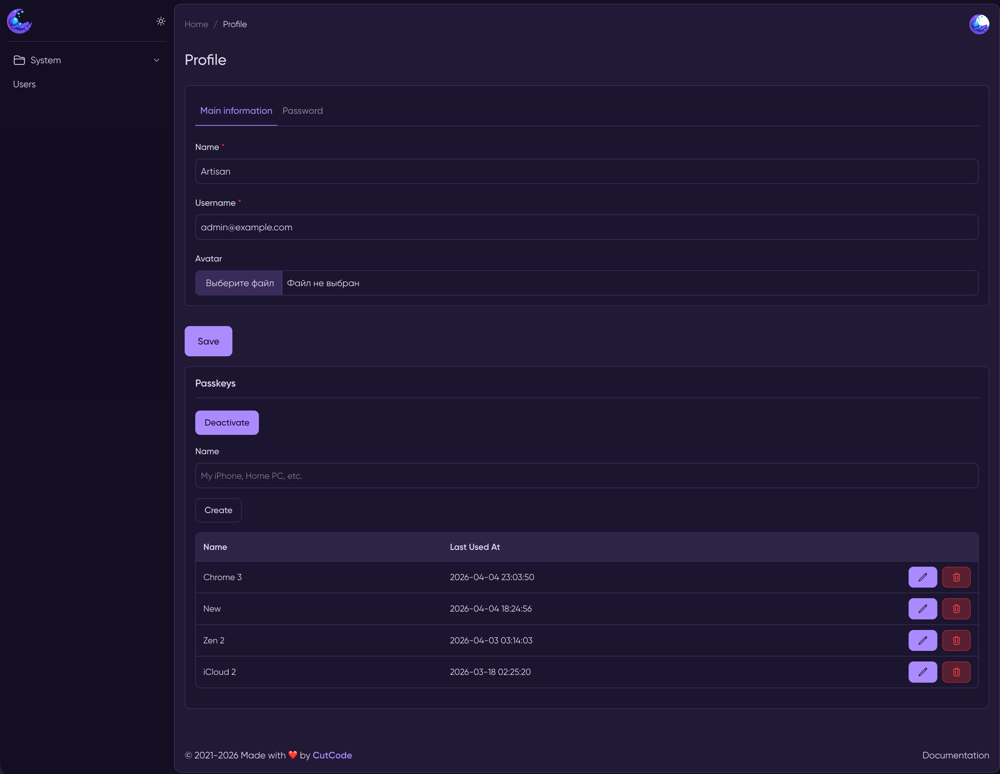

<p align="center">
    <a href="https://github.com/Jampire/moonshine-passkeys/actions/workflows/build.yml" target="_blank" title="build"></a>
    <a href="https://packagist.org/packages/Jampire/moonshine-passkeys" target="_blank" title="downloads"></a>
    <a href="https://github.com/Jampire/moonshine-passkeys/blob/master/LICENSE" target="_blank" title="license"></a>
    <a href="https://github.com/Jampire/moonshine-passkeys/releases" target="_blank" title="release"></a>
    <a href="https://packagist.org/packages/Jampire/moonshine-passkeys" target="_blank" title="php"></a>
    <a href="https://github.com/Jampire/moonshine-passkeys/graphs/contributors" target="_blank" title="contributors"></a>
    <a href="https://github.com/Jampire/moonshine-passkeys/issues" target="_blank" title="welcome"></a>
</p>

# Biometrics (Passkeys) for MoonShine Admin Panel

## Introduction
This package provides Biometric authentication and authorization for [MoonShine][1] admin panel.
It's based on [Passkeys][3] technology using [WebAuthn][2] protocol. Biometrics allows to login to the admin panel
using such technologies as Apple FaceID, Apple TouchID, Android Fingerprint, Windows Hello, Password Managers with
Passkey support, etc.

## Pre-requirements
Your admin panel should use HTTPS scheme only. Even the localhost.

## Installation

Use `composer` to install `MoonShine Passkeys` package:
```shell
composer require jampire/moonshine-passkeys
```
Publish a config file:
```shell
php artisan vendor:publish --provider="Jampire\MoonshinePasskeys\PasskeyServiceProvider" --tag=config
```

This package is designed to work in MoonShine only. You first need to install it. Please read
the [documentation][4] on how to install and configure MoonShine.

## Compatibility

|        MoonShine         | MoonShine Passkeys | Currently supported |
|:------------------------:|:------------------:|:-------------------:|
|         >= v4.0          |      >= v0.1       |         yes         |

## Configuration

*Auto-installer is coming soon...*

Passkeys are working with MoonShine User model. It should implement
[`Jampire\MoonshinePasskeys\Models\Contracts\PasskeyContract`][5] interface.

- If you are already using the custom MoonShine User model, you need just to add PasskeyContract interface
and [`Jampire\MoonshinePasskeys\Models\Concerns\HasPasskeys`][6] trait to your model.
- If you are using default MoonShine User model, you need to create new model that extends MoonShine User model,
and implement PasskeyContract interface:
```php
<?php

declare(strict_types=1);

namespace App\Models;

use Jampire\MoonshinePasskeys\Models\Concerns\HasPasskeys;
use Jampire\MoonshinePasskeys\Models\Contracts\PasskeyContract;
use MoonShine\Laravel\Models\MoonshineUser;

final class Admin extends MoonshineUser implements PasskeyContract
{
    use HasPasskeys;

    public function getTable(): string
    {
        return (new parent())->getTable();
    }
}
```
Then you need to tell MoonShine to use your new model:
```php
// config/moonshine.php

return [
    // ...

    // Authentication and profile
    'auth' => [
        // ...
        'model' => \App\Models\Admin::class,
        // ...
    ],

    // ...
];
```

Next step is to tell MoonShine to use `LoginForm` provided by this package:
```php
// config/moonshine.php

return [
    // ...

    // Authentication and profile
    'forms' => [
        // ...
        'login' => \Jampire\MoonshinePasskeys\Components\LoginForm::class,
        // ...
    ],

    // ...
];
```
It replaces the standard MoonShine Login form. For now, it doesn't support [Authentication pipelines][7].

Please review `config/passkeys.php`. All important options are described there.

## Usage
Passkey component is installed in the user's profile page (`admin/page/profile-page` by default):



Here is an example of how the package works on MacBook with iCloud Keychain and Conditional UI enabled:


*More detailed documentation is coming soon...*

## Contributing

Thank you for considering contributing to `MoonShine Passkeys` project! You can read the contribution guide [here][8].

## Code of Conduct
Please review and abide by the [Code of Conduct][9].

## Credits

- [Dzianis Kotau][10]
- [All Contributors][11]

## License
`MoonShine Passkeys` is open-sourced software licensed under the [MIT license][12].

[1]: https://getmoonshine.app/
[2]: https://www.w3.org/TR/webauthn-3/
[3]: https://en.wikipedia.org/wiki/WebAuthn
[4]: https://getmoonshine.app/en/docs/4.x/installation
[5]: src/Models/Contracts/PasskeyContract.php
[6]: src/Models/Concerns/HasPasskeys.php
[7]: https://getmoonshine.app/en/docs/4.x/security/authentication#authentication-pipelines
[8]: CONTRIBUTING.md
[9]: CODE_OF_CONDUCT.md
[10]: https://github.com/Jampire
[11]: https://github.com/Jampire/moonshine-passkeys/graphs/contributors
[12]: LICENSE
